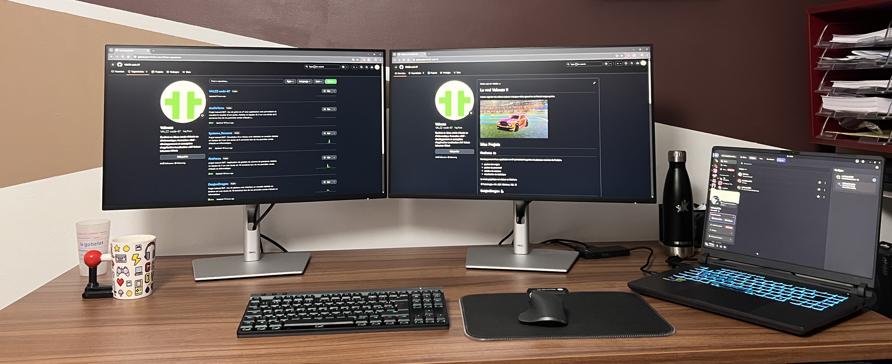

# Hello World !!

## A propos de moi
Je m'appelle Valentin, j'ai 19ans et je suis actuellement à l'université de Strasbourg dans le cadre d'un BUT en concéption et développement d'application.
J'adore regarder des animes, jouer à des jeux vidéo (grand fan de Rocket League perso) et sortir le weekend avec des amis.

[Mon CV ici](./CV_Valentin_Zou.pdf)

Mon setup :  

# Compétences

**Langages :**    

**Outils :**   

# Mes Projets
## [FireForce]("https://github.com/VALZZ-code-67/FireForce") 🚒
Developpement d'une application en C# permettant la gestion de plusieurs casernes de Pompier.
- gestion des engins
- gestion du personnel
- création de missions
- visualisation de statistique

Le rendu graphique est réaliser en WinForm

🛠️Techologies : C#, .NET, WinForm, SQL 🛠️
## DonjonDragon 🐉
DojonDragon est un jeu en console réaliser en ##java## inspirer du jeu de plateau original ##Donjon et Dragon.
- création du plateau (automatique)
- création des personnges (personnalisable)
- intéraction entre personnage et monstre (sort, attaque au corps)
- différentes armes, sorts

🛠️**Technologies** : Java, POO 🛠️
## Systeme_Reseaux 🛜
Concéption d'une simulation d'un réseau en C composé de switchs et de machines,
le but étant de pouvoir faire communiquer ces différents éléments entre eux.
- interface en console

🛠️**Technologies** : C 🛠️
## JeuDeYams 🎲
Développement d'un jeu de yams en language C# avec interface en console
accompagné d'une application web récupérant les données d'une partie pour les afficher en 2 modes différents :
- tour par tour
- vue globale (tous les tours)

🛠️**Technologies** : C#, JSON, HTML, CSS, JavaScript 🛠️

